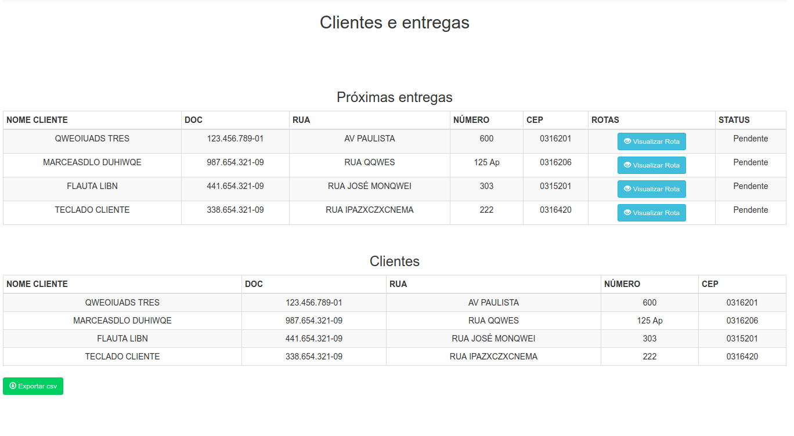

Delivery System - Php Developer test
--

This application is separated in two parts: api and front.

- Api (Lumen)
    - Can be consumed from various clients, including mobile apps
- Front application (AngularJS)
    - A front-end abstraction to upload clients to database and use geo* operations
    based on api data

To run docker and get db ready to go:
```
$ composer install

$ cd docker
$ docker-composer up

# Run migrations
$ docker-compose exec app php artisan migrate
```  

After run the commands above you can access:

### Api
```
http://localhost:8008/api/v1
```

### Front end application
```
http://localhost:8008/
```

Prints:




